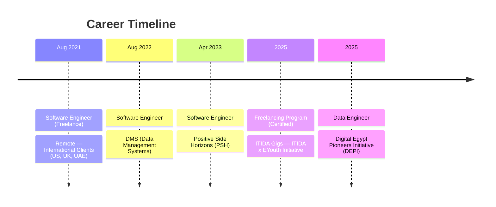

---

##  About Me

**Mahmoud Salem** · Software and Data Engineer · Cairo, Egypt
 
4+ Years in Enterprise-Grade Distributed Systems · Open for Remote and Freelance Opportunities

 

| | |
|:-:|-|
| 🎓 | **M.Sc.** — Data Science and Data Engineering · Cairo University *(In Progress)* |
| 🏅 | **Professional Diploma** — Web Development and BI · ITI *(2021–2022)* |
| 👨‍🏫 | **Academic Instructor and Mentor** · Cairo University · DEPI · Private · **300+ Students** |

<b>🔬 Theoretical Foundations</b>

 

| | |
|:-:|-|
| 📐 | Automata Theory · Formal Languages · Computability · Decidability |
| ⚙️ | Lexical Analysis · Parsing · Code Generation · Compiler Optimization |
| 🖥️ | Process Scheduling · Memory Management · Concurrency · File Systems |
| 🏗️ | Pipelining · Cache Hierarchies · ILP · Hardware-Aware Optimization |
| 🗄️ | Storage Engines · Buffer Pool Management · B+ Tree Indexing |
| 🔍 | Query Optimization · Cost-Based Planning · Join Algorithms |
| 🔒 | Concurrency Control (2PL, MVCC) · Crash Recovery (WAL, ARIES) |
| 💻 | Functional Programming · Lambda Calculus · Higher-Order Functions |
| 🧬 | OOP Thought Process · Type Systems · Logic Programming · Generics |
| 📊 | Amortized Analysis · Graph Algorithms · Dynamic Programming |
| 🧮 | Iterative Solvers · Interpolation · Finite Differences |
| 📈 | Statistical Inference · Probabilistic Modeling · Stochastic Processes |

<b>⚡ Applied Expertise</b>

 

| | |
|:-:|-|
| 🔄 | Event-Driven Architectures · RabbitMQ · Hangfire |
| 🧩 | CQRS · Event Sourcing · DDD · Identity Server 4 |
| 🗄️ | Query Plan Analysis · Index Tuning · Lock Contention · Partitioning |
| ☁️ | ETL/ELT Pipelines · Azure · AWS · Data Warehousing |
| 🚀 | 1M+ Daily Transactions · Sub-Second Latency · Connection Pooling |
| 🏛️ | Government-Scale Digital Transformation (Saudi Arabia and Egypt) |

> *"I approach software engineering the way a physicist approaches a complex system — by decomposing it into first principles, modeling interactions between components, and deriving solutions from fundamental constraints. Every design decision is grounded in complexity analysis, formal reasoning, and mathematical rigor — not convention or trend."*

---

##  The Analytical Edge

> *"My trajectory from Physics into Software Engineering wasn't a career change — it was a natural extension. The same **formal methods** I used to model physical systems now inform how I architect distributed software. Where most engineers rely on patterns and conventions, I derive solutions from **computational complexity bounds**, **formal language theory**, **database internals**, and **first-principles decomposition**. Mentoring 300+ students across multiple institutions has only deepened this rigor."*

| Foundation | How I Apply It |
|:-:|:-|
| 🧮 Numerical Analysis | Pipeline tuning · Cost-based query optimization |
| 📐 Algorithm Complexity | Trade-off analysis · Data structure selection |
| 🔬 Formal Languages | Parser design · Validation engines · State machines |
| 🗄️ Database Internals | Buffer pools · B+ trees · MVCC · WAL recovery |
| 🖥️ OS and Concurrency | Thread pools · Deadlock prevention · Contention |
| ⚙️ Compiler Design | AST manipulation · DSL construction |
| 🏗️ Computer Architecture | Cache-conscious design · Memory-aligned access |
| 💻 Programming Paradigms | OOP design · Functional composition · Type safety |
| 📊 Statistical Modeling | Anomaly detection · Predictive dashboards |

---

##  Tech Arsenal

<table align="center">
<tr>
<td align="center" width="50%">

### ⚙️ Backend & Data Engineering

</td>
<td align="center" width="50%">

### 🎨 Frontend Development

</td>
</tr>
<tr>
<td align="center" width="50%">

### 🗄️ Databases & Query Optimization

</td>
<td align="center" width="50%">

### ☁️ Cloud & DevOps

</td>
</tr>
<tr>
<td align="center" colspan="2">

### 🔌 Messaging, Architecture & Practices

</td>
</tr>
</table>

---

##  Professional Journey

---

##  Impact and Achievements

| Metric | Impact |
|:------:|:------:|
| 🏆 **Full Ownership** | **2 enterprise platforms** (Tamayuz & Qiyasi) — architected, developed & maintained **solo end-to-end** |
| ⚡ **Data Processing** | Reduced time by **70%** with Azure Data Factory & Synapse |
| 💰 **Cloud Costs** | Optimized by **35%** through strategic Azure management |
| 👥 **Users Served** | Systems serving **10,000+** users with **99.9%** uptime |
| 📊 **Daily Transactions** | Handled **1M+** for Saudi government transformation |
| 🏥 **Healthcare** | ICU monitoring across **500+** hospitals nationwide |
| 🗺️ **GIS Analytics** | Health dashboards covering **27** Egyptian governorates |
| 💳 **E-Commerce** | Platforms processing **$500K+** monthly transactions |
| ✍️ **Automation** | Reduced manual errors by **60%** in government systems |
| 🎓 **Mentoring** | Guided **300+** students across **Cairo University**, **DEPI**, and **private sessions** in **9** CS disciplines |

---

##  Featured Projects

<b>🏢 Enterprise and Government Systems</b> (Click to expand)

 

🏆 **Tamayuz Platform** — *Sole Developer, Full Ownership End-to-End*
> Enterprise GRC and Organizational Excellence platform. Microservices architecture with modern Angular, legacy Web Forms, background processing, and message queuing.
>
> `Microservices` `ASP.NET Core` `Angular` `Web Forms` `RabbitMQ` `Hangfire` `Identity Server 4` `SQL Server`

🏆 **Qiyasi System** — *Sole Developer, Full Ownership End-to-End*
> Saudi government digital transformation platform.
>
> `.NET Core` `Microsoft Graph API` `OAuth 2.0` `OneDrive`

**Netaj System** — Scalable APIs + Angular serving 10K+ users
> `ASP.NET Core` `Angular` `RabbitMQ` `Identity Server 4` `ELK`

**National Marriage Registration** — Nationwide government automation
> `Oracle` `ASP.NET MVC` `jQuery`

**Health Analytics Dashboard** — GIS visualization for health statistics
> `Real-time Analytics` `GIS Mapping` `Statistical Modeling`

**ICU Management System** — Hospital monitoring (500+ hospitals)
> `ASP.NET` `SQL Server` `Real-time Dashboards`

<b>🌐 Freelance and International Projects</b> (Click to expand)

 

**E-Commerce Platforms** — Custom platforms for US, UK, UAE clients
> `ASP.NET Core` `Angular` `Stripe` `PayPal`

**Healthcare Patient Portals** — HIPAA-compliant patient management
> `.NET Core` `RBAC` `Data Encryption`

**SaaS Applications** — Multi-tenant with subscription management
> `Clean Architecture` `DDD` `Automated Billing`

<b>💻 Open Source and Personal</b> (Click to expand)

 

⭐ [**Problem-Solving-Patterns**](https://github.com/ma7moudalysalem/Problem-Solving-Patterns) — C# algorithm patterns guide
> Sliding windows · Two-pointers · Fast/slow iterators · Interval merging · Cyclic sorting

⭐ [**Fawry Data Engineering**](https://github.com/ma7moudalysalem/fawry-data-engineering-case-study) — Lambda Architecture for fraud detection
> `Kafka` `Flink` `Spark`

[**e-Tickets**](https://github.com/ma7moudalysalem/e-Tickets) — Full-stack e-commerce · `ASP.NET Core` `Clean Architecture`

[**E-Commerce Angular**](https://github.com/ma7moudalysalem/E-commerceAngular) — Angular-based e-commerce frontend

[**Billing System**](https://github.com/ma7moudalysalem/BillingSystem) — Desktop invoicing solution in C#

---

##  Education and Teaching

> *Passionate **Academic Instructor and Mentor** with teaching experience across **Cairo University**, **DEPI**, and **private sessions** — collectively impacting **300+ students** across core Computer Science and Data Engineering disciplines.*

| | |
|:-:|-|
| 📊 | **M.Sc.** — Data Science and Data Engineering · Cairo University *(In Progress)* |
| 🏅 | **Professional Diploma** — Web Development and BI · ITI *(2021–2022)* |
| 🎖️ | **ITIDA Gigs** — Certified Freelancing Program · ITIDA x EYouth *(2025)* |
| 🎖️ | **DEPI** — Data Engineering Track · Digital Egypt Pioneers Initiative *(2025)* |

<b>📚 Courses Taught and Assisted</b> (Click to expand)

 

**Cairo University**

| | |
|:-:|-|
| 🖥️ | Operating Systems |
| ⚙️ | Compiler Design |
| 🏗️ | Computer Architecture |
| 📐 | Theory of Computation |
| 🧮 | Mathematics for CS |
| 💻 | Programming Language Paradigms |

**Cairo University, DEPI, and Private**

| | |
|:-:|-|
| 🗄️ | Database Systems |
| 📊 | Algorithms and Data Structures |

**DEPI and Private**

| | |
|:-:|-|
| 🔬 | Data Science |

---

##  GitHub Analytics

<picture>
  <source media="(prefers-color-scheme: dark)" srcset="https://raw.githubusercontent.com/ma7moudalysalem/ma7moudalysalem/output/github-snake-dark.svg" />
  <source media="(prefers-color-scheme: light)" srcset="https://raw.githubusercontent.com/ma7moudalysalem/ma7moudalysalem/output/github-snake.svg" />
  
</picture>

---

##  Let's Connect

| | Contact |
|:-:|---------|
| 📧 | [ma7moudalysalem@gmail.com](mailto:ma7moudalysalem@gmail.com) |
| 📱 | +20 101 162 0431 |
| 📍 | Cairo, Egypt |
| 💼 | [linkedin.com/in/ma7moudalysalem](https://linkedin.com/in/ma7moudalysalem) |

 

> *"From automata theory and compiler internals to distributed architectures handling millions of transactions — I engineer formally reasoned, mathematically grounded systems that solve real problems at scale."*

